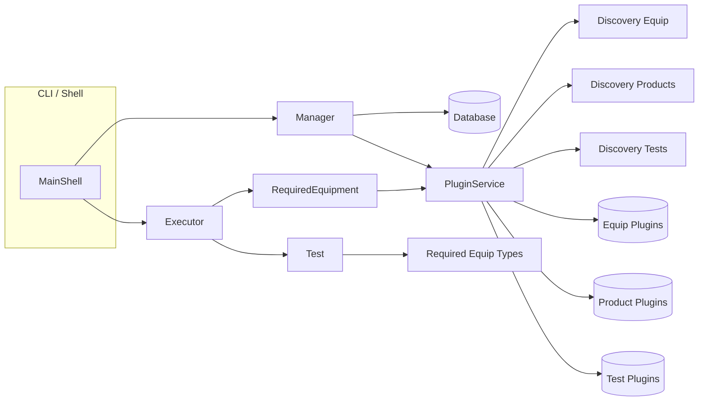
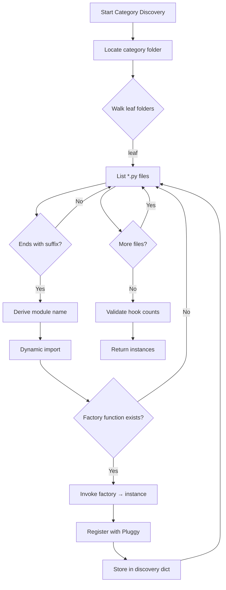
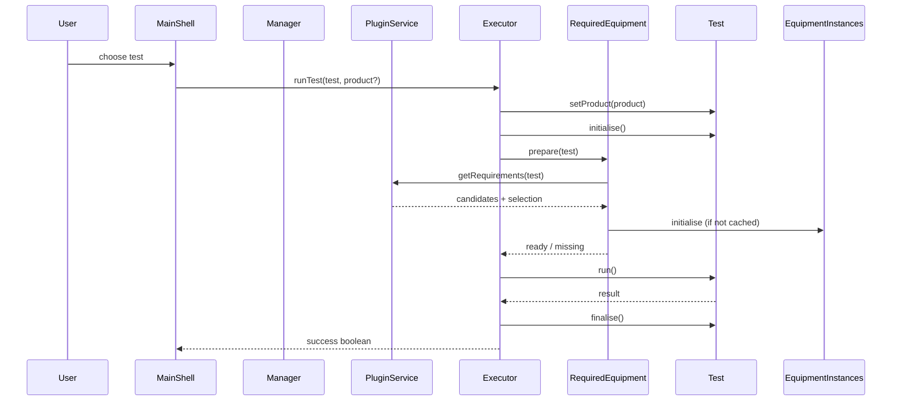
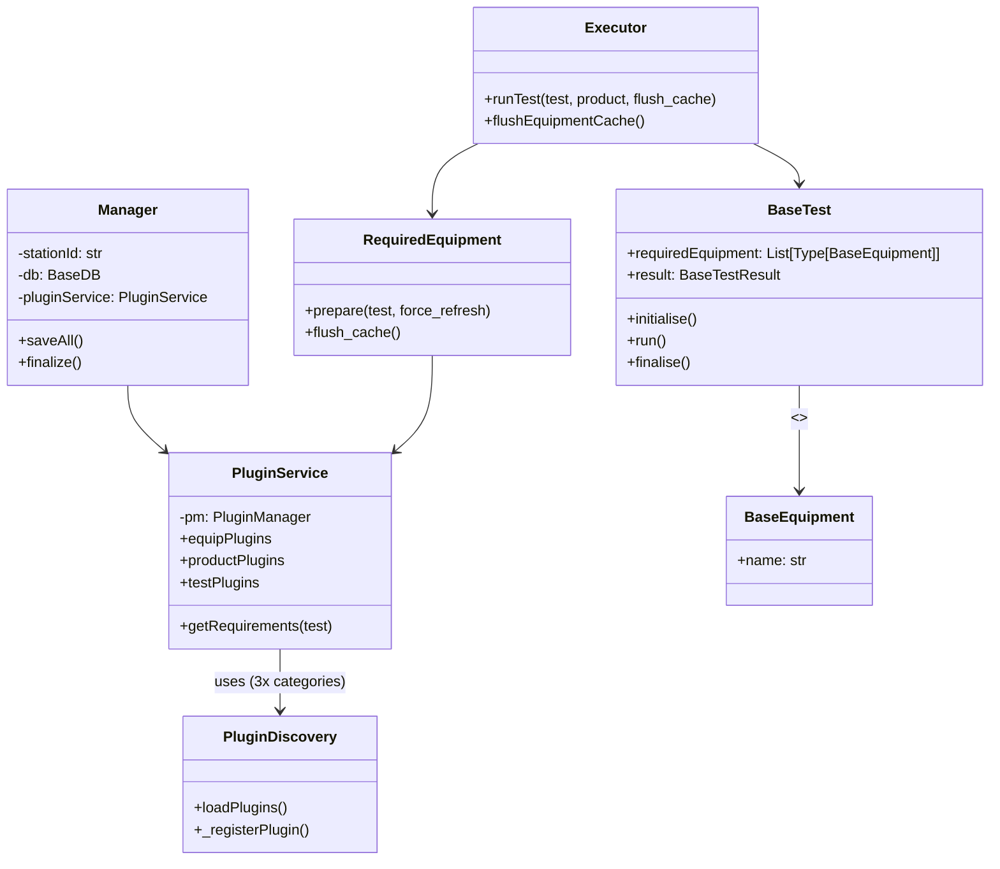

# Cerberus Core Runtime Architecture (Manager, Plugin Service, Discovery, Executor & Shell)

This document gives both a high‑level and in‑depth explanation of how the following core classes coordinate a test run:

- `MainShell` (command interface / CLI entry – see `cmdShells/mainShell.py`)
- `Manager` (lifecycle + persistence of plugin parameter values)
- `PluginDiscovery` (filesystem scanning & dynamic loading of plugin modules)
- `PluginService` (owns the pluggy manager, holds discovered plugin instances, resolves requirements)
- `Executor` (runs an individual test with required equipment selection / caching)

> Supporting pieces not expanded here but referenced: `RequiredEquipment` (equipment caching & preparation), the various `Base*` abstract classes (`BasePlugin`, `BaseEquipment`, `BaseProduct`, `BaseTest`, `BaseTestResult`), and persistence layer (`GenericDB`, `FileDatabase`).

---
## 1. Conceptual Overview
A Cerberus test session looks like this:
1. User launches CLI (`CerberusCLI.py`) → constructs and enters `MainShell`.
2. Shell parses configuration (INI), sets up logging & database connection.
3. `Manager` is instantiated:
   - Creates a `PluginService` which immediately discovers & instantiates plugin classes (equipment, products, tests).
   - Loads any persisted parameter values from the DB into each plugin instance.
4. User selects/executes a test (via shell or higher UI). An `Executor` is used to run a single test instance:
   - Optionally injects a `BaseProduct` instance.
   - Resolves required equipment types for the test.
   - Prepares / initialises equipment (first suitable instance per required type) with caching.
   - Runs the test, captures result, performs cleanup.
5. On shutdown (context exit), `Manager` saves current plugin parameter values and closes the database.

The architecture cleanly separates discovery (static phase) from execution (dynamic phase), while permitting equipment reuse across many tests through caching.

---
## 1.1 Visual Architecture (Diagrams)

Below are Mermaid diagrams (GitHub and many Markdown renderers support these). Plain‑text fallbacks follow for environments without Mermaid rendering.

### High-Level Component Interaction


### Plugin Discovery Flow (Per Category)


### Test Execution Sequence


### Class Relationships (Simplified)


### Plain-Text Fallback (High-Level Sequence)
```
User -> MainShell -> Executor -> Test.initialise
Executor -> RequiredEquipment -> PluginService.getRequirements
PluginService -> (equipment instances filtered by isinstance)
RequiredEquipment -> (initialise selected equipment once, cache)
Executor -> Test.run -> Test.finalise -> Result
```

---
## 2. Class Summaries
### MainShell
Entry point interactive command shell. Responsibilities:
- Parse CLI args (database choice, config file).
- Show splash/status feedback during plugin discovery (via a callback passed into `Manager` / `PluginService`).
- Provide sub‑shells for equipment, products, tests, plans, database, manager functions.
- Own the lifetime context of `Manager` (using `with Manager(...)`).

### Manager
High‑level lifecycle & persistence coordinator.
Responsibilities:
- Hold the current `stationId`, database object, and a `PluginService`.
- Immediately after plugin discovery, bulk load persisted parameter values (equipment, tests, products) from the DB, overlaying defaults.
- Provide `saveAll()` to persist the current state back to the DB.
- Context manager semantics ensure `finalize()` is always called (persist + close DB) even if errors occur.

### PluginDiscovery
Low‑level module scanner & loader for one plugin *category* (Equipment / Product / Test).
Responsibilities:
- Determine the directory (e.g. `Cerberus/plugins/equipment`) for a category.
- Walk leaf folders, identify Python files that end with the category suffix (e.g. `*Equipment.py`, `*Test.py`, `*Product.py`).
- Dynamically load modules via `importlib.util.spec_from_file_location`.
- Register each module with Pluggy and invoke its factory function (`create{PluginType}Plugin`) to obtain an instantiated subclass of `BasePlugin`.
- Provide case‑insensitive dictionary lookup of plugin instances by their `name` property.
- Report missing or mismatched hook implementations (diagnostics to help plugin authors).

### PluginService
Aggregator / façade over the three plugin discovery runs.
Responsibilities:
- Initialise a Pluggy `PluginManager`.
- For each category (`Equipment`, `Product`, `Test`) run a `PluginDiscovery` and retain the resulting dict of plugin instances.
- Offer lookups by name or by concrete subclass type (e.g. find all equipment that are instances of a specific derived class).
- Validate product ID mapping (`PROD_ID_MAPPING`).
- Compute *requirements* for a test via `getRequirements(test)`, returning:
  - `candidates`: map of required equipment type → list of all loaded instances matching that type.
  - `missing`: list of required types with zero matches.
  - `selection`: deterministic choice (currently: **first** candidate).

### Executor
Encapsulates execution of a single `BaseTest` instance.
Responsibilities:
- Inject an optional product onto the test (`test.setProduct(product)`).
- Initialise the test (`test.initialise()`).
- Resolve & prepare required equipment via `RequiredEquipment.prepare()` (using the cached / selection policy from earlier calls; optionally `flush_cache` forces re-selection / re-initialisation).
- Run the test (`test.run()`), handle `TestError`, always `finalise()` the test.
- Evaluate the `test.result.status` and return boolean success (allowing `PASSED` or `SKIPPED`).

---
## 3. How These Pieces Fit Together
Below is the canonical sequence when executing a test interactively:

1. CLI starts → `MainShell.runShell()` → constructs `Manager` with status callback.
2. `Manager.__init__`:
   - Instantiates `PluginService`.
   - `PluginService` creates three `PluginDiscovery` instances and calls `loadPlugins()` for each category:
     1. For each plugin file matching naming convention, dynamically import the module.
     2. Register module with Pluggy, call the factory function (`createEquipmentPlugin`, etc.) to obtain an instance.
     3. Insert instance into the `PluginDiscovery` dict keyed by `basePlugin.name`.
   - After all plugins are instantiated, `Manager` loads persisted parameter values from the database into each plugin instance (equipment → tests → products) so runtime state reflects prior configuration.
3. User chooses a test to run (e.g. through the test shell). An `Executor` is created (or reused) with the same `PluginService`.
4. `Executor.runTest()` steps:
   - Set product (if provided).
   - Call `test.initialise()` – test sets up internal state but hasn't run yet.
   - Optionally flush cached equipment (manual override or if equipment environment changed).
   - Call `required_equipment.prepare(test)` which (internally) will:
     - Ask `PluginService.getRequirements(test)` for each required equipment **type** (classes listed in `test.requiredEquipment`).
     - For each required type, look at all discovered equipment instances; if multiple match, choose the **first** (current policy). Caching avoids repeating discovery/selection on subsequent tests unless flushed.
     - (Implementation detail of `RequiredEquipment`): instantiate / open connections / mark as initialised only once, reuse across tests.
   - Execute `test.run()`; capture domain errors (`TestError`).
   - Always `test.finalise()` to allow resource cleanup or result collation.
   - Inspect `test.result` (a `BaseTestResult`); treat `PASSED` or `SKIPPED` as success.

```
[User] -> MainShell -> Manager -> PluginService -> (PluginDiscovery * 3) -> Plugins
        -> Executor -> RequiredEquipment -> PluginService.getRequirements()
        -> Test.initialise/run/finalise -> Result
```

---
## 4. Plugin Discovery Mechanics (Detailed)
1. Directory Derivation: For category `Equipment`, folder path is `Cerberus/plugins/equipment` (lower‑cased).
2. Leaf Folder Walk: Recursively traverses; a leaf (no subdirs after filtering) is considered a *plugin folder*.
3. File Filtering: In a leaf folder, any file ending with the exact suffix (e.g. `Equipment.py`) and not starting with `__` is treated as a candidate module.
4. Module Naming: File path is transformed into a dotted module path relative to the project root (`rel_path.replace(os.sep, '.')[:-3]`). This allows multiple nested packages while avoiding import cache collisions.
5. Dynamic Import: `importlib.util.spec_from_file_location` builds a spec; module inserted into `sys.modules` *before* execution to support intra‑module relative imports.
6. Hook Registration: Pluggy hookspec interface for the category (e.g. `EquipmentSpec`) is imported from `.../hookspecs.py` and added once per category.
7. Factory Invocation: Looks for `create{PluginType}Plugin` (e.g. `createEquipmentPlugin`) in the module, invokes it, obtains a `BasePlugin` subclass instance.
8. Registration & Storage: Instance is stored by its `name` attribute (case‑insensitive lookup implemented in `__getitem__`).
9. Diagnostics: After scanning all folders, a hook implementation consistency check warns if declared hookspecs lack implementations or counts mismatch.

This approach gives:
- Zero static import cost for unused plugins (lazy-ish but done at startup).
- Isolation: a broken plugin logs an exception but does not abort discovery of others.
- Extensibility: new plugins simply require the correct naming convention and a factory function.

---
## 5. Equipment Requirement Resolution & Initialisation
A `BaseTest` declares `requiredEquipment: List[Type[BaseEquipment]]` describing abstract types (e.g. `SignalGenerator`, `SpectrumAnalyser`). At runtime:

1. `PluginService.getRequirements(test)` iterates each required type.
2. It collects all instantiated equipment objects for which `isinstance(equip, requiredType)` is true.
3. Result categories:
   - `candidates[type]` = list of matching instances (may be length > 1).
   - `missing` includes the type if list is empty.
   - `selection[type]` currently set to the first candidate in the list.
4. The `RequiredEquipment` helper (not shown) likely:
   - Checks cache: if the same test (or same requirement set) ran previously and equipment are still initialised/online, reuse them.
   - For each selected instance not yet initialised, open connections (e.g. VISA, sockets, serial), perform identification / health check to mark as ready.
5. If any required type is missing (no candidates), preparation fails and the executor aborts the test gracefully.

### 5.1 Parent Instrument Delegation (Facet Devices)
Some physical instruments expose *logical* sub‑devices that do not own an independent transport (e.g. Rohde & Schwarz NRP power sensors when physically connected through an SMB100A signal generator). To model these cleanly while preserving a single physical VISA session, Cerberus now supports a lightweight parent/child (facet) pattern:

Core concepts:
1. Facet equipment classes (e.g. `NRP_Z22`, `NRP_Z24`) declare a `REQUIRED_PARENT` string naming the parent instrument. Example: `REQUIRED_PARENT = "SMB100A"` in `BaseNRPPowerMeter`.
2. Facet devices do not inherit from `VISADevice` nor open sessions. Instead they delegate SCPI calls to the already‑initialised parent via a minimal structural protocol (write/query/command/operationComplete).
3. Dependency preparation is performed inline by `RequiredEquipment` (method `_prepare_dependencies`) before calling `initialise()` on a candidate. It:
   - Looks for `REQUIRED_PARENT` on the candidate.
   - Finds the parent instance via `PluginService`.
   - Initialises the parent first (if not already initialised).
   - Injects the parent into the child's `initialise` call as `initialise({'parent': parent})`.
   - Emits a debug log: `Injected <ParentName> into <ChildName>` for traceability.
4. The child’s `initialise` method validates that a parent was supplied and fails fast if not, ensuring ordering correctness without a hard‑coded numeric priority system.
5. Tests remain unchanged – they still list only the abstract required types. The resolver implicitly ensures the parent appears and is ready before the child is selected.

Why this approach over priorities:
- Declarative: dependencies are part of the plugin’s self‑description (`REQUIRED_PARENT`).
- Deterministic initialisation ordering is derived naturally (parents first) without manual priority tuning.
- Extensible: future multi‑parent support can evolve inside the resolver without changing plugin call sites.

Fallback / Error Handling:
- If the parent is missing, the child candidate is skipped; other candidates (if any) are tried.
- If parent initialisation fails, the failure is logged and the child is not attempted.
- If all candidates fail (including due to parent issues) the original failure path in `RequiredEquipment` is preserved.

Debug tracing example (simplified):
```
DEBUG requiredEquipment: Injected SMB100A into NRP-Z22
DEBUG requiredEquipment: NRP-Z22 (#1/1) initialised for requirement BasePowerMeter
```

Implementation Files:
- `plugins/equipment/powerMeters/RohdeSchwarz/NRP/baseNPRPowerMeter.py` – facet model & declares `REQUIRED_PARENT`.
- `requiredEquipment.py` – contains the dependency preparation logic (`_prepare_dependencies`).

Limitations (current scope):
- Only a single parent is honoured (first element). Multi‑parent or dependency cycles are not yet supported (not needed for current hardware topology).
- Parent discovery assumes the parent plugin instance name matches the declared string exactly.

### Multiple Equipment Instances
You can provide multiple physical or virtual instruments implementing the same abstract capability; all are discovered. The *current selection policy* is deterministic but primitive: choose the first discovered candidate (folder traversal order). This keeps logic simple but does not evaluate "online" vs. "offline" dynamically inside `PluginService` itself—responsibility for verifying operational status (e.g. connectivity) belongs to the equipment plugin's own initialise routine or the `RequiredEquipment` layer. When a plugin fails to initialise, future enhancements could fall back to other candidates automatically (see below).

---
## 6. Error Handling & Robustness Notes
- Discovery: Exceptions in module load are logged (stacktrace) and the offending plugin is skipped; startup continues.
- Hook Consistency: After discovery a mismatch between expected and registered implementations triggers warnings to highlight incomplete or misnamed plugins.
- Execution: A `TestError` during `test.run()` is captured; test finalisation runs regardless.
- Persistence: Failures in saving parameters on shutdown are logged but don't block shutdown.

---
## 7. Further Development Ideas
The current design establishes a solid separation of concerns; below are enhancements that could increase resiliency, performance, and flexibility.

### 7.1 Equipment Selection Strategy
Current: first candidate.
Potential improvements:
- Priority Attributes: Allow each `BaseEquipment` plugin to publish a numeric priority (e.g. `selection_priority`) or dynamic scoring method (latency, calibration date, health metrics).
- Health / Online Detection: Maintain a heartbeat or last‑verified timestamp; filter out stale/offline devices before scoring.
- Load Balancing: Rotate choices across equally suitable devices to distribute wear / usage.
- Capability Matching: Use richer capability descriptors (frequency range, bandwidth, option codes) and choose the *best fit* instead of first match.
- Fallback Logic: If chosen device fails to initialise, automatically attempt the next candidate without forcing a manual cache flush.

### 7.2 Requirement Resolution Cache Improvements
- Cache Key: Include required types + optional capability constraints to avoid recomputing candidate lists.
- Invalidation: Watch for hot‑plug events or periodic re‑probes to invalidate stale entries.

### 7.3 Parallel Initialisation
- When multiple heavy instruments are required, initialise them concurrently (thread or async) to reduce startup latency.

### 7.4 Deferred Plugin Instantiation
- Store metadata discovered via lightweight scanning (e.g. parse headers / small descriptors) and only fully import heavy plugins when first requested.

### 7.5 Test Sandbox & Dry Run
- Provide a dry run mode where requirement resolution is executed and a plan is printed without initialising equipment.

### 7.6 Enhanced Persistence
- Versioned parameter schema & migration tooling.
- Per‑product overrides layered atop global defaults.

### 7.7 Observability
- Structured events for each lifecycle step (discovery, selection, initialisation) to external telemetry system (e.g. OpenTelemetry spans).

### 7.8 CLI UX
- Auto‑completion of test names + filtering by tags / required equipment.
- Real‑time status panel showing which devices are currently allocated and their usage counts.

### 7.9 Plugin Hot Reload
### 7.10 Enhanced Dependency Graph (Future)
Future enhancements could include:
- Multi‑parent dependency support with a full DAG traversal & cycle detection.
- Topological sorting of all required equipment in one batch for improved parallel initialisation opportunities.
- Capability‑based dynamic parent selection (choose among multiple possible parents matching a functional capability descriptor rather than a fixed name).
- Watch plugin directories for file changes; support safe in‑process reload (unregister & replace) for rapid development.

---
## 8. Quick Reference Flow
1. Start CLI → `MainShell`.
2. Create `Manager` (context) → inside: create `PluginService` → each category uses `PluginDiscovery` to load plugin instances.
3. `Manager` loads persisted parameters into those instances.
4. User selects test → `Executor.runTest()`:
   - Initialise test.
   - Prepare equipment (resolve + select + initialise via cache layer).
   - Run test logic.
   - Finalise test; inspect `BaseTestResult`.
5. Exit context → `Manager.finalize()` saves parameters & closes DB.

---
## 9. Glossary
- *Plugin*: Concrete subclass instance of `BaseEquipment`, `BaseProduct`, or `BaseTest` produced by its category factory function.
- *Requirement*: An abstract equipment class listed by a test indicating a capability need.
- *Candidate*: A discovered equipment plugin instance that `isinstance` satisfies a requirement type.
- *Selection*: The chosen candidate used to fulfil a requirement during a test run.
- *Parent Instrument*: A physical instrument that owns the transport/session and provides SCPI access for one or more facet devices.
- *Facet Equipment (Child)*: A logical equipment plugin that delegates all I/O to a parent instrument instead of opening its own connection.

---
## 10. Summary
The Cerberus runtime cleanly divides responsibilities: discovery is explicit and deterministic, state persistence is centralised in the `Manager`, while per‑test orchestration and equipment selection are isolated in the `Executor` + requirement resolution helpers. This modularity enables incremental enhancement—particularly around smarter equipment selection and dynamic health awareness—without disrupting existing plugin contracts.

